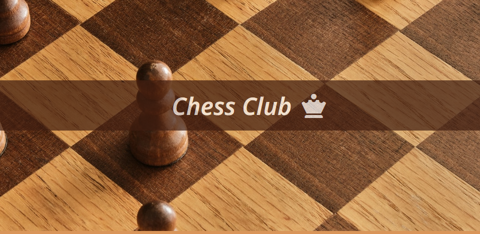

# Challenge Project: Responsive Club Website

## Chess Club

This is a *CodeCademy* challenge project, where I have to create a web page. The theme of the page is about a Club. In my case, as I like chess very much, I will make a **Chess Club** web page.

## Project objectives

The page has to respond dynamically to screen changes, i.e. it has to be mobile responsive. Therefore, I have to use *CSS* tools like **Flexbox,** relative measures like `rem` and `em`. Among other requirements that meet the objective in question, to be adaptable to mobile devices!

## Project completed

After a lot of work, I was able to reach the final goal. Of course, there is always room for improvement, but I am really satisfied with how the site turned out.